# Monitoring Stack Configuration Documentation

This repository contains a complete Grafana monitoring stack with comprehensive configuration documentation to help you safely modify and maintain your observability infrastructure.

## 📋 Stack Overview

Our monitoring stack includes:

- **[Grafana Alloy](docs/alloy-config-guide.md)** - Telemetry data pipeline (OpenTelemetry collector)
- **[Grafana Loki](docs/loki-config-guide.md)** - Log aggregation system
- **[Grafana Tempo](docs/tempo-config-guide.md)** - Distributed tracing backend
- **[Prometheus](docs/prometheus-config-guide.md)** - Metrics collection and storage
- **Grafana** - Visualization and dashboards
- **Pyroscope** - Continuous profiling

## 🧠 How It Works: Theory and Architecture

### Overview

This monitoring stack implements the **three pillars of observability**: **Metrics**, **Logs**, and **Traces**. It follows modern observability best practices by using OpenTelemetry standards for data collection and providing a unified platform for correlation and analysis.

### Data Flow Architecture


### Component Interactions


### Three Pillars of Observability

#### 1. **Metrics** (Prometheus)
- **What**: Numerical measurements over time (CPU usage, request rate, error count)
- **When**: Continuous monitoring, alerting, capacity planning
- **How**: Time-series data with labels for high-cardinality querying
- **Example**: `http_requests_total{method="GET", status="200"} 1234`

#### 2. **Logs** (Loki)
- **What**: Timestamped text records of events
- **When**: Debugging, audit trails, detailed investigation
- **How**: Indexed by labels, stored efficiently with compression
- **Example**: `2024-01-15 10:30:45 INFO [user-service] User login successful user_id=12345`

#### 3. **Traces** (Tempo)
- **What**: Request journey across distributed services
- **When**: Performance debugging, dependency analysis, latency investigation
- **How**: Spans with parent-child relationships forming trace trees
- **Example**: HTTP request → Database query → Cache lookup → Response

### OpenTelemetry Standards

Our stack uses **OpenTelemetry (OTLP)** protocol for standardized telemetry collection:

```mermaid
graph LR
    subgraph "OpenTelemetry Protocol"
        OTLP[OTLP<br/>gRPC: 4317<br/>HTTP: 4318]
    end
    
    subgraph "Data Types"
        Metrics[📊 Metrics<br/>Counters, Gauges<br/>Histograms, Summaries]
        Logs[📝 Logs<br/>Structured Events<br/>with Attributes]
        Traces[🔍 Traces<br/>Spans with Context<br/>and Relationships]
    end
    
    OTLP --> Metrics
    OTLP --> Logs
    OTLP --> Traces
    
    style OTLP fill:#ffeb3b
```



### Data Processing Pipeline

**Grafana Alloy** acts as the central processing hub:

1. **Reception**: Receives telemetry data from multiple sources
2. **Processing**: Applies transformations, filtering, and enrichment
3. **Routing**: Sends data to appropriate storage backends
4. **Monitoring**: Provides visibility into pipeline health


### How External Services Use This Stack

#### For Application Developers


#### Integration Examples

**Python Application:**
```python
from opentelemetry import trace
from opentelemetry.exporter.otlp.proto.grpc.trace_exporter import OTLPSpanExporter
from opentelemetry.sdk.trace import TracerProvider
from opentelemetry.sdk.trace.export import BatchSpanProcessor

# Configure to send to our Alloy collector
otlp_exporter = OTLPSpanExporter(endpoint="http://localhost:4317")
span_processor = BatchSpanProcessor(otlp_exporter)

tracer_provider = TracerProvider()
tracer_provider.add_span_processor(span_processor)
trace.set_tracer_provider(tracer_provider)
```

**Docker Application:**
```yaml
# docker-compose.yml
services:
  your-app:
    environment:
      - OTEL_EXPORTER_OTLP_ENDPOINT=http://alloy:4317
      - OTEL_SERVICE_NAME=your-service
      - OTEL_RESOURCE_ATTRIBUTES=service.version=1.0.0
```

### Data Correlation and Analysis

The power of this stack comes from **correlated observability**:

```mermaid
graph TB
    subgraph "Unified View"
        TraceID[Trace ID: abc123]
        UserID[User ID: user456]
        ReqID[Request ID: req789]
    end
    
    subgraph "Correlation"
        Metric[📊 High error rate<br/>service=api, status=500]
        Log[📝 Exception details<br/>trace_id=abc123]
        Trace[🔍 Request flow<br/>spans across services]
    end
    
    TraceID --> Metric
    TraceID --> Log
    TraceID --> Trace
    
    UserID --> Metric
    UserID --> Log
    
    ReqID --> Log
    ReqID --> Trace
    
    style TraceID fill:#ff9800
```



### Monitoring Strategy

**Proactive Monitoring Approach:**

1. **Golden Signals**: Latency, Traffic, Errors, Saturation
2. **SLI/SLO Tracking**: Service Level Indicators and Objectives  
3. **Alert Hierarchy**: Page → Alert → Warning
4. **Incident Response**: Metrics → Logs → Traces progression

**Query Examples:**
```promql
# Prometheus - Error rate
rate(http_requests_total{status=~"5.."}[5m]) / rate(http_requests_total[5m])

# LogQL - Find errors with trace correlation
{service="api"} |= "ERROR" | json | trace_id != ""

# TraceQL - Find slow database queries
{.service.name="database" && duration > 1s}
```

This architecture provides a complete observability solution where each component serves a specific purpose while working together to give you comprehensive insight into your systems' behavior and performance.

## 🚀 Quick Start

1. **Start the stack:**
   ```bash
   docker-compose up -d
   ```

2. **Access services:**
   - Grafana: http://localhost:3002 (admin/admin)
   - Alloy UI: http://localhost:12345
   - Prometheus: http://localhost:9090
   - Pyroscope: http://localhost:4040

3. **Send test data:**
   ```bash
   # Send traces to Alloy
   curl -X POST http://localhost:4318/v1/traces \
     -H "Content-Type: application/json" \
     -d '{"resourceSpans":[...]}'
   
   # Send logs
   curl -X POST http://localhost:4318/v1/logs \
     -H "Content-Type: application/json" \
     -d '{"resourceLogs":[...]}'
   ```

## 📖 Configuration Guides

Each service has detailed configuration documentation with parameter explanations, validation rules, and best practices:

### 🔧 [Alloy Configuration Guide](docs/alloy-config-guide.md)
- OpenTelemetry receivers and processors
- Data pipeline configuration
- Performance tuning parameters
- Security and authentication settings

### 📊 [Loki Configuration Guide](docs/loki-config-guide.md)
- Log ingestion and storage settings
- Schema configuration and migration
- Retention and compaction policies
- Multi-tenancy and security

### 🔍 [Tempo Configuration Guide](docs/tempo-config-guide.md)
- Distributed tracing configuration
- Storage backends and retention
- Query optimization settings
- Metrics generation from traces

### 📈 [Prometheus Configuration Guide](docs/prometheus-config-guide.md)
- Service discovery and scraping
- Storage and retention settings
- Alerting and recording rules
- Remote write configuration

### ⚡ [Quick Reference Guide](docs/quick-reference.md)
- Common configuration tasks
- Performance tuning examples
- Security hardening steps
- Troubleshooting commands

## 🛠️ Configuration Management

### Validation Script

Before making changes, use the validation script to check your configuration:

```bash
# Run configuration validation
./scripts/validate-config.sh
```

This script checks:
- File structure and syntax
- Docker Compose validity
- Service configuration completeness
- Security settings
- Port conflicts
- Resource configurations

## ⚙️ Configuration File Structure

```
monitoring-stack/
├── alloy/
│   └── config.alloy              # Alloy telemetry pipeline
├── loki/
│   └── loki-config.yaml          # Loki log aggregation
├── prometheus/
│   └── prometheus.yml            # Prometheus metrics
├── tempo/
│   └── tempo.yaml                # Tempo distributed tracing
├── grafana/
│   ├── provisioning/             # Data source configs
│   └── dashboards/               # Pre-built dashboards
└── docker-compose.yml            # Container orchestration
```

## Prerequisites

*   [Docker](https://docs.docker.com/get-docker/)
*   [Docker Compose](https://docs.docker.com/compose/install/)

## Setup

1.  **Clone the repository (or ensure you have the files):**
    ```bash
    # If applicable
    # git clone <your-repo-url>
    # cd <your-repo-directory>
    ```

2.  **Start the stack:**
    ```bash
    docker-compose up -d
    ```
    This command will build the necessary images (if not already present) and start all the services in detached mode.

## Accessing Services

*   **Grafana:** `http://localhost:3002`
    *   Default credentials: `admin` / `admin` (Configurable via `GF_SECURITY_ADMIN_PASSWORD` in `docker-compose.yml`)
    *   Datasources for Prometheus, Tempo, and Loki are pre-provisioned.
*   **Alloy UI:** `http://localhost:12345` - Monitor data pipeline status and component health
*   **Prometheus:** `http://localhost:9090` - Query metrics directly or access via Grafana
*   **Pyroscope:** `http://localhost:4040` - Continuous profiling interface
*   **Tempo:** Accessed via Grafana datasource (Internal port: `3200`)
*   **Loki:** Accessed via Grafana datasource (Internal port: `3100`)
*   **Alloy OTLP Endpoints:** 
    *   gRPC: `localhost:4317`
    *   HTTP: `localhost:4318`

## Configuration Files

Configuration files for each service are located within their respective directories:

*   **Alloy:** `./alloy/config.alloy` - [Configuration Guide](docs/alloy-config-guide.md)
*   **Prometheus:** `./prometheus/prometheus.yml` - [Configuration Guide](docs/prometheus-config-guide.md)
*   **Tempo:** `./tempo/tempo.yaml` - [Configuration Guide](docs/tempo-config-guide.md)
*   **Loki:** `./loki/loki-config.yaml` - [Configuration Guide](docs/loki-config-guide.md)
*   **Grafana Provisioning:** `./grafana/provisioning/` (Datasources, dashboards)

### Making Configuration Changes

1. **Edit the configuration file** using the corresponding guide
2. **Validate the configuration** (see troubleshooting section)
3. **Restart the specific service** or entire stack:

```bash
# Restart a specific service (e.g., tempo)
docker-compose restart tempo

# Restart the entire stack
docker-compose down && docker-compose up -d
```

### Configuration Validation

Before restarting services, validate your changes:

```bash
# Validate Docker Compose
docker-compose config

# Validate Alloy configuration
docker run --rm -v $(pwd)/alloy:/etc/alloy grafana/alloy:latest fmt /etc/alloy/config.alloy

# Validate Prometheus configuration
docker run --rm -v $(pwd)/prometheus:/etc/prometheus prom/prometheus:latest promtool check config /etc/prometheus/prometheus.yml
```

## Data Persistence

Data for Prometheus, Tempo, Loki, and Grafana is persisted using named Docker volumes:

*   `prometheus-data`
*   `tempo-data`
*   `loki-data`
*   `grafana-storage`

To remove the data, you can stop the stack and remove the volumes:

```bash
docker-compose down -v
```

## 🔒 Security Best Practices

### Development Environment
Current configuration is optimized for development with:
- Authentication disabled on most services
- Insecure TLS settings
- Permissive network bindings

### Production Hardening
For production deployments:

1. **Enable Authentication:**
   ```yaml
   # Loki
   auth_enabled: true
   
   # Grafana
   GF_AUTH_ANONYMOUS_ENABLED: false
   ```

2. **Configure TLS:**
   ```alloy
   # Alloy
   tls {
     insecure = false
     cert_file = "/path/to/cert.pem"
     key_file = "/path/to/key.pem"
   }
   ```

3. **Restrict Network Access:**
   ```yaml
   # Bind to specific interfaces
   endpoint = "127.0.0.1:4317"
   ```

4. **Set Resource Limits:**
   ```yaml
   # Docker Compose
   deploy:
     resources:
       limits:
         memory: 2G
         cpus: '1.0'
   ```

## 📊 Performance Tuning

### High Volume Environments

**Alloy (High Throughput):**
```alloy
otelcol.processor.batch "traces" {
  timeout = "2s"
  send_batch_size = 2048
  send_batch_max_size = 4096
}
```

**Loki (High Ingestion):**
```yaml
limits_config:
  ingestion_rate_mb: 50
  ingestion_burst_size_mb: 100
  per_stream_rate_limit: 10MB
```

**Tempo (Large Traces):**
```yaml
server:
  grpc_server_max_recv_msg_size: 8388608  # 8MB
distributor:
  receivers:
    otlp:
      protocols:
        grpc:
          max_recv_msg_size_mib: 8
```

### Resource-Constrained Environments

**Reduce Memory Usage:**
```yaml
# Loki
limits_config:
  max_streams_per_user: 1000
  max_entries_limit_per_query: 1000

# Tempo
overrides:
  max_traces_per_user: 1000
  ingestion_rate_limit_bytes: 5000000  # 5MB/s
```

## 🔍 Troubleshooting

### Common Issues

1. **Service Connection Errors**
   ```bash
   # Check service health
   curl http://localhost:3100/ready    # Loki
   curl http://localhost:3200/ready    # Tempo
   curl http://localhost:9090/-/ready  # Prometheus
   ```

2. **Configuration Validation**
   ```bash
   # Validate configurations
   docker-compose config
   alloy fmt alloy/config.alloy
   promtool check config prometheus/prometheus.yml
   ```

3. **View Service Logs**
   ```bash
   docker-compose logs -f loki
   docker-compose logs -f tempo
   docker-compose logs -f alloy
   ```

### Performance Monitoring

Monitor stack performance using built-in metrics:

1. **Alloy Metrics:** http://localhost:12345/metrics
2. **Loki Metrics:** http://localhost:3100/metrics
3. **Tempo Metrics:** http://localhost:3200/metrics
4. **Prometheus Metrics:** http://localhost:9090/metrics

### Debug Configuration

Enable detailed logging:

```yaml
# docker-compose.yml
services:
  loki:
    command: 
      - -log.level=debug
  
  tempo:
    command: 
      - -log.level=debug
```

## 📈 Scaling and Production Deployment

### Horizontal Scaling

For production workloads, consider:

1. **Multi-instance deployment:**
   ```yaml
   services:
     loki:
       deploy:
         replicas: 3
   ```

2. **External storage backends:**
   ```yaml
   # Loki with S3
   storage_config:
     aws:
       s3: s3://my-loki-bucket
   
   # Tempo with S3
   storage:
     trace:
       backend: s3
       s3:
         bucket: my-tempo-bucket
   ```

3. **Load balancing:**
   ```nginx
   upstream loki {
     server loki-1:3100;
     server loki-2:3100;
     server loki-3:3100;
   }
   ```

### Monitoring the Monitor

Set up monitoring for your monitoring stack:

1. **Prometheus scraping all services**
2. **Grafana dashboards for each component**
3. **Alerting on service health and performance**
4. **Regular backup of configurations and data**

## 📚 Additional Resources

### Official Documentation
- [Grafana Documentation](https://grafana.com/docs/)
- [Grafana Alloy](https://grafana.com/docs/alloy/)
- [Grafana Loki](https://grafana.com/docs/loki/)
- [Grafana Tempo](https://grafana.com/docs/tempo/)
- [Prometheus](https://prometheus.io/docs/)

### Community Resources
- [Grafana Community](https://community.grafana.com/)
- [OpenTelemetry Documentation](https://opentelemetry.io/docs/)
- [CNCF Observability](https://www.cncf.io/projects/)

### Configuration Examples
- [Grafana Labs Examples](https://github.com/grafana/grafana)
- [OpenTelemetry Collector Examples](https://github.com/open-telemetry/opentelemetry-collector-contrib)

## 🤝 Contributing

To contribute to this documentation:

1. **Test changes** in a development environment
2. **Validate configurations** using provided tools
3. **Update relevant guide** in the `docs/` directory
4. **Update this README** if adding new components

## 📝 License

This monitoring stack configuration is provided as-is for educational and development purposes. Please review and modify security settings before production deployment.

---

**Need help?** Check the individual configuration guides or create an issue with your specific configuration question.
